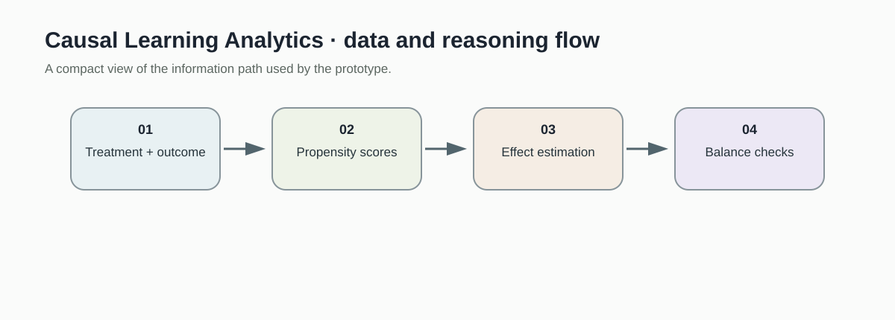
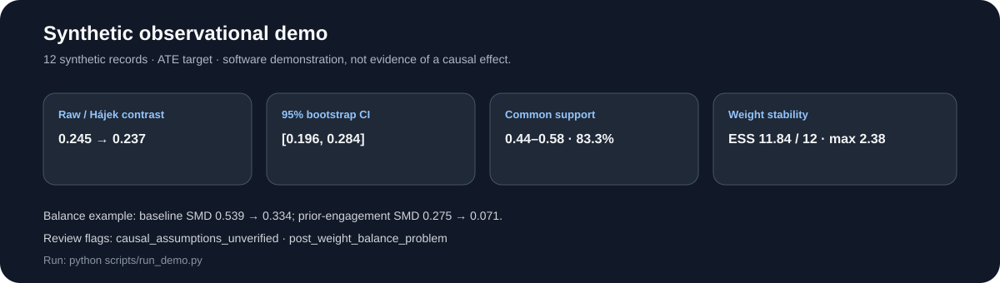
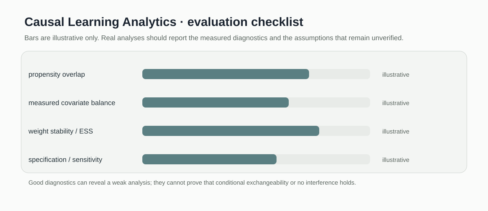

# Causal Learning Analytics

> Compact causal analysis baseline for inverse probability weighting, overlap checks, and covariate balance diagnostics.

[](https://github.com/devissaputra/causal-learning-analytics/actions/workflows/ci.yml)


**Area:** Learning Analytics & Multimodal Evidence    
**Status:** working research prototype  
**Author:** Devis Wawan Saputra

## What this project is for

Prediction can tell us who is at risk; it cannot by itself tell us whether an intervention caused an improvement. This project provides a small, inspectable causal-analysis workflow built around propensity scores, weighting, overlap checks, and explicit assumptions.

**Who may find it useful:** Learning-analytics researchers who need to separate causal questions from ordinary prediction tasks.

## Research questions

1. Which observed learning behaviors are associated with outcomes after adjustment?
2. How sensitive are estimates to propensity overlap and confounding assumptions?
3. Can intervention decisions be separated from purely predictive correlations?

## How it works

The baseline assumes treatment assignment, outcomes, and propensity scores are already available. It then estimates an average treatment effect with inverse probability weights and provides two diagnostics: propensity overlap and standardized mean difference. It does not fit a propensity model or infer a causal graph.



The diagram now follows what the code actually does: observed treatment and outcome data are combined with propensity scores, weighted, and checked for overlap and balance before an effect estimate is interpreted.



This snapshot shows the bundled synthetic example for Causal Learning Analytics. It checks the software path; it is not an empirical performance result.

## Methods in the current baseline

- inverse probability weighting
- average treatment effect estimation
- propensity overlap checks
- standardized mean differences
- weight clipping

## Data

Synthetic observational intervention data are included for reproducible demonstrations.

`data/README.md` documents the sample schema and the conditions that should be recorded before any real dataset is connected. Restricted or identifiable learner data should stay outside the repository.

## Run the demo

```bash
git clone https://github.com/devissaputra/causal-learning-analytics.git
cd causal-learning-analytics
python scripts/run_demo.py
python -m unittest discover -s tests -v
```

The synthetic demo uses binary treatment labels, continuous outcomes, and four propensity scores. It prints the weighted treatment effect and the share of scores inside the chosen overlap region.

## What to evaluate next

A serious version should estimate propensity scores from pre treatment covariates, define the causal estimand before analysis, examine weight instability, and run sensitivity analyses for unmeasured confounding.

## Evaluation view



The Causal Learning Analytics dashboard is an evaluation checklist rather than a result chart. The bars are illustrative only; the labels show the evidence a real study would need to collect.

## Limits and responsible use

Inverse probability weighting only supports a causal interpretation when the identification assumptions are credible. This repository demonstrates mechanics and diagnostics, not proof that an intervention caused an outcome. See `docs/ethics_and_risks.md` for the broader risk review.

## Repository map

```text
.
├── .github/workflows/ci.yml
├── assets/
│   ├── architecture.svg
│   ├── data_flow.svg
│   ├── demo_snapshot.svg
│   └── evaluation_dashboard.svg
├── data/
│   ├── README.md
│   └── sample.csv
├── docs/
│   ├── ethics_and_risks.md
│   ├── related_work.md
│   └── research_protocol.md
├── reports/model_card.md
├── scripts/run_demo.py
├── src/causal_learning_analytics/core.py
├── tests/test_core.py
├── CITATION.cff
├── LICENSE
├── pyproject.toml
└── README.md
```

## Research path

A credible next version would:

1. add a documented propensity model using only pre treatment variables
2. report balance before and after weighting
3. run sensitivity and alternative specification checks

## Related work

`docs/related_work.md` points to open projects that are relevant to this problem area. They are context for comparison and study design; this repository does not present their code as its own.

## Citation and license

`CITATION.cff` contains the software citation. The code and original SVG visuals use the MIT License. Any external dataset keeps its own license and usage conditions.
