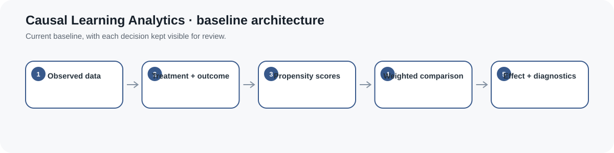

# Causal Learning Analytics — OULAD Day-30 Landmark Research Bundle

**Research Bundle · AI in Education · observational causal inference · learning analytics**

This repository studies a deliberately narrow question in the Open University Learning Analytics Dataset (OULAD): among learners who are registered and still under observation at presentation day 30, what adjusted contrast in favorable final course outcome is associated with having submitted at least one **non-banked** assessment by that landmark?

The design uses a day-30 landmark so treatment classification, eligibility and outcome follow-up are temporally separated. It does not claim that early submission itself causes success.

## Frozen study declaration

**Eligibility at day 30**
- registered on or before presentation day 30;
- not unregistered on or before day 30;
- withdrawn learners must have an observed unregistration date after day 30.

**Exposure**
At least one non-banked assessment submitted after registration and on or before day 30.

**Outcome**
Pass or Distinction versus Fail or withdrawal after the day-30 landmark.

**Target population**
The selected OULAD module-presentation cohort satisfying the landmark eligibility rule and the frozen complete-case adjustment rule.

**Estimand**
An ATE-style observational contrast in that landmark population under explicit causal assumptions.

## Why the landmark matters

The original prototype classified exposure using activity accumulated through day 30 while allowing withdrawals during that same period to count as adverse outcomes. That mixes treatment assignment and outcome timing.

The current protocol instead establishes eligibility at the end of the exposure window. Learners who already unregistered by day 30 are not part of the landmark population. This makes the timing contract executable and inspectable.

OULAD records unregistration day in studentRegistration and marks transferred prior-assessment results using is_banked in studentAssessment. The empirical adapter uses both fields explicitly.

## Baseline adjustment set

Numeric variables:
- studied credits;
- number of previous attempts;
- registration timing.

Categorical variables:
- age band;
- highest prior education;
- deprivation band;
- disability indicator;
- gender;
- region.

Categorical variables are one-hot encoded rather than forced into arbitrary linear ordinal scores. See [docs/causal_dag.md](docs/causal_dag.md) for the adjustment rationale and causal graph.

## Empirical workflow

1. Retrieve the pinned UCI OULAD archive and record its SHA-256.
2. Validate unique learner-registration keys.
3. Exclude banked assessment records from exposure construction.
4. Apply the day-30 registration/withdrawal landmark.
5. Select one module-presentation cohort.
6. Report complete-case exclusions for every frozen adjustment covariate.
7. Restrict categorical baseline levels that have no observed exposed or unexposed comparison and record every positivity-support exclusion.
8. Fit a standardized numeric + one-hot categorical logistic propensity model.
9. Inspect overlap, IPW weights, effective sample size and covariate balance.
10. Report raw, Horvitz-Thompson and Hájek ATE-style contrasts.
11. Use a **full-refit bootstrap** that refits the propensity model inside every resample as the primary ATE uncertainty interval.
12. Retain the fixed-propensity bootstrap as a secondary diagnostic.
13. Report overlap-weighted ATO sensitivity with its own full-refit interval and balance diagnostics.
14. Run common-support, clipping and propensity-specification sensitivity analyses.
15. Generate empirical propensity, balance, weight and sensitivity figures.
16. Preserve causal non-claims and review flags.

## Reproduce

For normal development:

    python -m venv .venv
    source .venv/bin/activate
    pip install -r requirements.txt
    python -m unittest discover -s tests -v
    python scripts/run_oulad_study.py

For the professor-facing reproduction environment, use requirements-repro.txt.

A specific cohort can be frozen only by supplying both arguments:

    python scripts/run_oulad_study.py --module CCC --presentation 2014J

Supplying only one is rejected.

## Evidence map

| Evidence | Location |
|---|---|
| Dataset source and temporal fields | DATA.md |
| Research protocol | docs/research_protocol.md |
| Causal graph and adjustment rationale | docs/causal_dag.md |
| Dataset card | docs/dataset_card.md |
| Analysis card | reports/model_card.md |
| Executable OULAD adapter | scripts/run_oulad_study.py |
| Core IPW implementation | src/causal_learning_analytics/core.py |
| Core + adapter tests | tests/ |
| Machine-readable empirical record | results/oulad_metrics.json |
| Generated empirical summary | results/summary.md |
| Empirical figures | results/figures/ |
| Manuscript | paper/paper.md |
| Ethics and non-claims | ETHICS.md |
| Evidence contract | RESEARCH_BUNDLE.md |

## Interpretation boundary

Measured covariate balance does not prove exchangeability. OULAD does not fully measure motivation, prior achievement, work constraints, access, instructional context or every determinant of both early submission and final outcome. The adjusted contrast remains observational unless the causal assumptions are independently defensible.

This repository is a transparent causal-learning-analytics research bundle, not a learner-scoring or intervention-deployment system.
