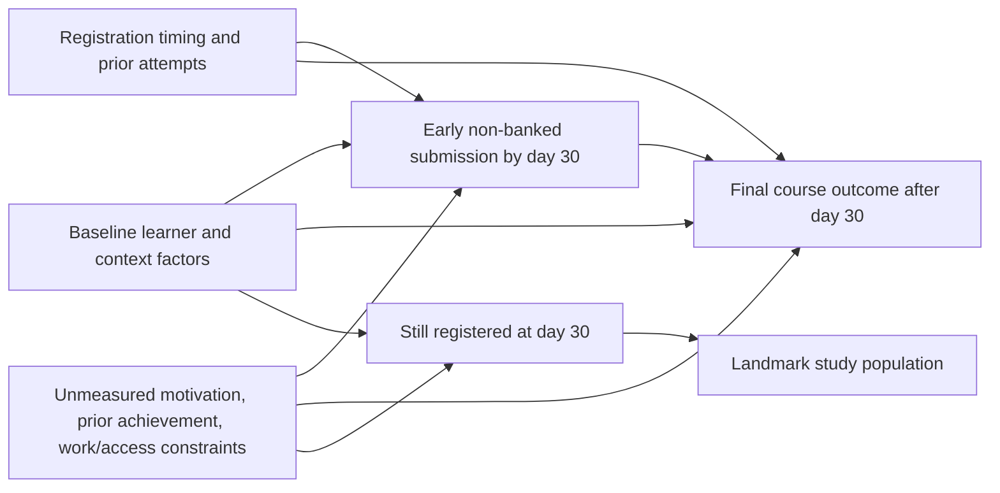

# Causal Graph and Adjustment-Set Rationale

## Causal question

Within the day-30 landmark population, what adjusted contrast in favorable final course outcome is associated with early non-banked assessment submission?

## Conceptual DAG

The unmeasured node is intentionally shown. The graph does not assert that exchangeability is achieved.

## Frozen measured adjustment set

| Variable | Role considered in design |
|---|---|
| studied_credits | baseline study load may influence both submission opportunity and course outcome |
| num_of_prev_attempts | prior course experience/difficulty may influence both |
| date_registration | timing of entry can affect available preparation time and later outcome |
| age_band | baseline demographic/context variable associated with study circumstances |
| highest_education | proxy for prior educational preparation |
| imd_band | contextual socioeconomic/deprivation measure |
| disability | baseline accessibility/context variable |
| gender | baseline demographic variable used only for aggregate confounding adjustment |
| region | baseline contextual/geographic proxy that can relate to learner circumstances |

## Variables deliberately excluded

- assessment score: occurs as part of/post exposure process and can mediate later outcome;
- post-day-30 assessment behavior: post-treatment;
- VLE activity after the landmark: post-treatment;
- final_result: outcome;
- date_unregistration after day 30: part of outcome timing, not baseline adjustment.

## Important limitation

OULAD does not contain every relevant common cause. In particular, motivation, employment obligations, detailed prior achievement, household resources, accessibility barriers and course-specific support are incompletely measured.

Balance on the measured variables therefore cannot be interpreted as proof that the early-submission contrast is causal.

## Landmark-selection boundary

Requiring continued registration through day 30 defines the target population. Continued registration can itself depend on measured and unmeasured factors. The study estimates a contrast within that landmark population rather than the full original registration population.
