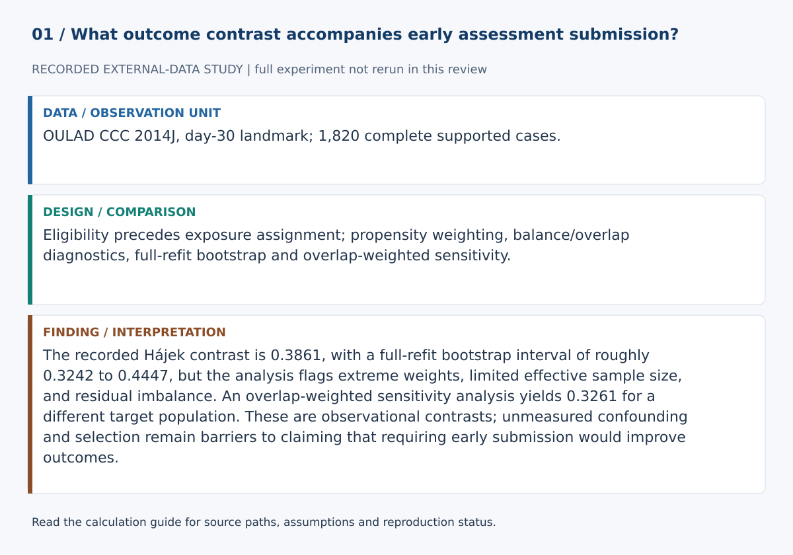
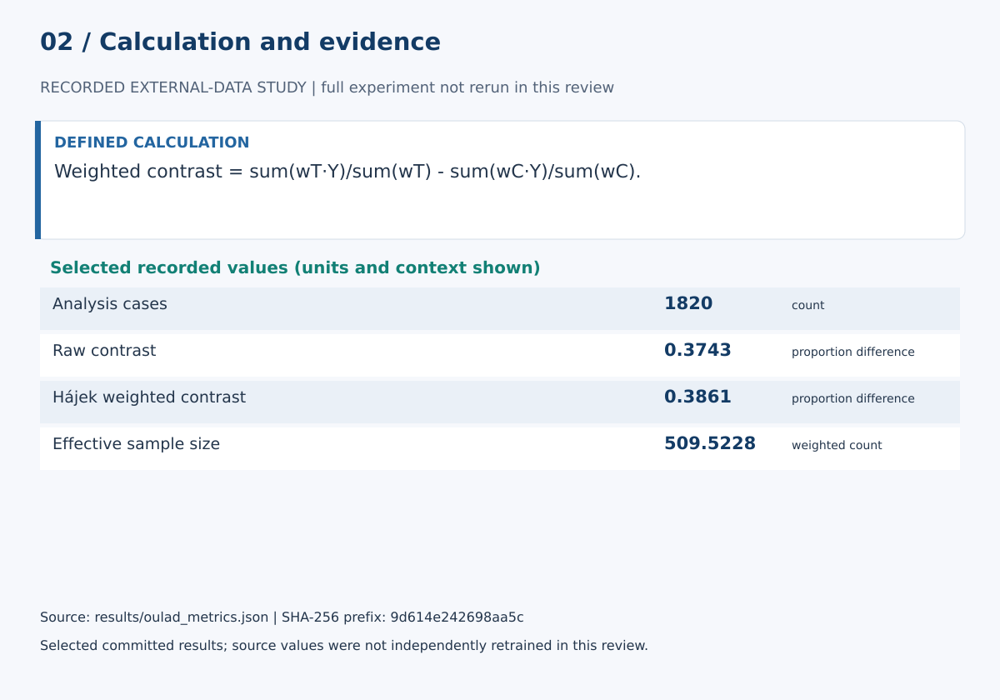

# Early Non-Banked Assessment Submission and Later Course Outcome in OULAD: A Day-30 Landmark IPW Study

## Abstract

Learning-analytics studies often associate early engagement with later success, but a causal interpretation can be distorted when the exposure is accumulated over time while outcomes such as withdrawal can occur during the same window. This study uses a day-30 landmark design in the Open University Learning Analytics Dataset (OULAD). Learners must be registered and still under observation at day 30. Exposure is at least one non-banked assessment submitted after registration and by day 30. The analysis compares favorable final course outcomes using inverse-probability weighting over a frozen baseline adjustment set, reports overlap and covariate balance, uses a full-refit bootstrap for uncertainty, and performs common-support and propensity-specification sensitivity analyses. The study remains observational and does not claim that early submission itself causes success.

## Research question

Within one day-30 landmark OULAD module-presentation cohort, what ATE-style adjusted outcome contrast is associated with early non-banked assessment submission?

## Background

OULAD links learner background, registration timing, assessment records and final outcomes across historical Open University module-presentations (Kuzilek et al., 2017).

The temporal design follows the principle that eligibility, exposure assignment and the start of outcome follow-up should be aligned when observational data are used for causal questions (Hernán et al., 2016). This is especially important here because OULAD records withdrawals during the course and assessment exposure is accumulated through day 30.

## Data

The runner obtains OULAD through UCI dataset 349 (DOI 10.24432/C5KK69), records the archive SHA-256 and uses studentInfo, studentRegistration, assessments and studentAssessment.

Raw data are not committed.

## Landmark design

The landmark is presentation day 30.

Eligible learners:
1. registered on or before day 30;
2. did not unregister on or before day 30;
3. if recorded as Withdrawn, have an observed unregistration date after day 30.

Exposure is at least one non-banked assessment submitted after registration and by day 30.

The favorable outcome is Pass or Distinction. Fail and withdrawal after day 30 form the adverse outcome category.

This design intentionally conditions the target population on continued registration to day 30. It therefore estimates a contrast in the landmark population, not in all original registrations.

## Adjustment set and empirical support

Numeric covariates are studied credits, previous attempts and registration timing.

Categorical covariates are age band, highest education, deprivation band, disability, gender and region. They are one-hot encoded in the propensity model rather than mapped to arbitrary ordinal distances.

Before propensity estimation, categorical baseline levels with no observed exposed/unexposed comparison are removed using an outcome-blind empirical support rule and the exclusions are recorded. This narrows the target population rather than extrapolating across unsupported strata.

The causal rationale and omitted-variable boundary are documented in docs/causal_dag.md.

## Analysis

A standardized mixed-feature logistic model estimates propensity scores. The study reports:
- raw treated-minus-control difference;
- Horvitz-Thompson ATE-style estimate;
- normalized Hájek ATE-style estimate;
- empirical common support;
- weight distribution and effective sample size;
- standardized mean differences before and after weighting;
- fixed-propensity bootstrap uncertainty;
- full-refit bootstrap uncertainty;
- common-support restriction sensitivity;
- alternate propensity-specification sensitivity.

The full-refit bootstrap is the primary uncertainty interval because the propensity model is re-estimated in each bootstrap sample.

## Results

Numerical evidence is generated by scripts/run_oulad_study.py into:
- results/oulad_metrics.json;
- results/summary.md;
- paper/results.md;
- results/figures/.

This manuscript intentionally does not hard-code a favorable result independent of the generated evidence.

## Limitations

The landmark design corrects a temporal misalignment but does not eliminate confounding. Continued registration to day 30 is part of the target-population definition and may itself depend on measured and unmeasured factors. OULAD incompletely measures motivation, prior achievement, work constraints, access, support and other common causes.

Complete-case analysis can induce selection. Propensity models can be misspecified. One module-presentation does not establish external validity. Good measured balance does not prove exchangeability.

## Ethics and educational interpretation

An observed contrast should not be converted directly into a policy that pressures learners to submit earlier. Early submission may be a marker of preparation, opportunity or constraints rather than an independently manipulable cause.

The study is intended for methodological research, not learner scoring or automated intervention.

## References

Austin, P. C., & Stuart, E. A. (2015). Moving towards best practice when using inverse probability of treatment weighting using the propensity score to estimate causal treatment effects in observational studies. *Statistics in Medicine, 34*, 3661–3679. https://doi.org/10.1002/sim.6607

Hernán, M. A., Sauer, B. C., Hernández-Díaz, S., Platt, R., & Shrier, I. (2016). Specifying a target trial prevents immortal time bias and other self-inflicted injuries in observational analyses. *Journal of Clinical Epidemiology, 79*, 70–75. https://doi.org/10.1016/j.jclinepi.2016.04.014

Hernán, M. A., & Robins, J. M. *Causal Inference: What If*. Chapman & Hall/CRC. https://www.hsph.harvard.edu/miguel-hernan/causal-inference-book/

Kuzilek, J., Hlosta, M., & Zdrahal, Z. (2017). Open University Learning Analytics dataset. *Scientific Data, 4*, 170171. https://doi.org/10.1038/sdata.2017.171

## Calculation definitions and evidence audit

Weighted contrast = sum(wT·Y)/sum(wT) - sum(wC·Y)/sum(wC).

Treated weights are 1/e and control weights 1/(1-e), where e is estimated exposure propensity. Effective sample size is (sum w)^2/sum(w^2). ATE-style weighting does not itself identify a causal effect; overlap weighting changes the target population.

The recorded Hájek contrast is 0.3861, with a full-refit bootstrap interval of roughly 0.3242 to 0.4447, but the analysis flags extreme weights, limited effective sample size, and residual imbalance. An overlap-weighted sensitivity analysis yields 0.3261 for a different target population. These are observational contrasts; unmeasured confounding and selection remain barriers to claiming that requiring early submission would improve outcomes.

The [calculation guide](../CALCULATIONS.md) provides exact evidence paths and a function-level implementation map.

### Selected evidence and interpretation

| Quantity | Value | Unit / meaning | JSON path |
|---|---:|---|---|
| Analysis cases | 1820 | count | `sample_size` |
| Raw contrast | 0.3742962702322309 | proportion difference | `raw_mean_difference` |
| Hájek weighted contrast | 0.3861104115308514 | proportion difference | `ipw_ate_hajek` |
| Effective sample size | 509.5228012320698 | weighted count | `weight_diagnostics.overall_ess` |

These values are read from `results/oulad_metrics.json`. They must be interpreted with the split, data status and limitations above. The complete data/model experiment was not rerun in this review. Stored empirical results were inspected, not independently reproduced from raw data.

### Reproduction and claim boundaries

45 existing unittest checks passed. The figure generator can be checked with `python scripts/build_review_figures.py --check`. This verifies the displayed calculation evidence, not an independent replication of the complete scientific experiment. The manuscript is a working report, not a peer-reviewed publication.
